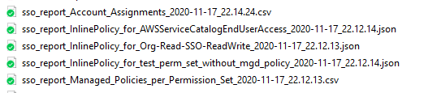
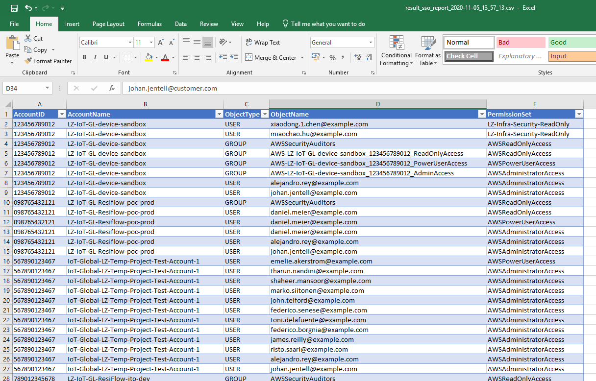
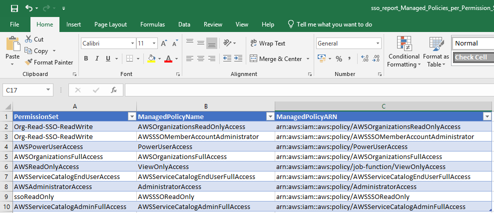
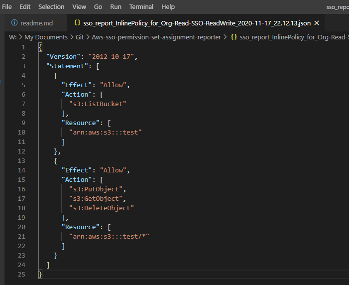

# Why do I need this?
Many customers with big AWS SSO environments struggle to create an overview over who has been given access to what. The GUI does not present any easy way of answering questions like:

* What accounts does user John Doe have access to?
* What permission sets are attached to him?
* Which users and groups have access to our App-Prod-Account?

This tools uses the AWS SSO API to list all users, accounts, permission sets etc. and dumps it into a CSV file for additional parsing or viewing. 

# AWS SSO Permission Set Assignment Reporter

AWS SSO Permission Set Assignment Reporter consists of two script that exports information on the AWS SSO setup. The goal with the report is to be able to import the data into for example a spreadsheet and answer questions from the following perspectives:

**1. For each AWS Account list:**

* Which users are direct-assigned to the account, and using what Permission Set?
* Which security groups are assigned to the account, and using what Permission Set?

**2. For each User and Security Group list:**

* Which account a user or security group has access to, and using what Permission Set?

**3. For each Permission Set list:**

* Which AWS accounts the permission set is assigned to, and with which users and security groups?

**4. For each Permission Set list:**
* What Managed policies are attached to it?
* What Inline Policy is attached to it?

## Usage

1. Login to your AWS SSO Management Account with credentials to read from AWS Organizations and AWS SSO services using AWS CLI or AWS Access Keys  
2. Set your region `aws configure set default.region eu-west-1v
3. Run the scripts:
4. `sso-account-permission-assignment-report.py` to create a CSV with all AWS Account assignments. `python3 sso-permission-set-report.py`
5. `sso-permission-set-report.py` to get a CSV summary file and JSON files of each permission set inline policy `python3 sso-permission-set-report.py`
6. The CSV files can be imported to for example a spreadsheet or a database for further analysis.

## Dependencies
### Python 3

These scripts depends on Python 3. Please ensure Python 3 is installed and in your path, or use a virtual environment.

To install the required libraries run the following command in the root folder:

```pip install -r requirements.txt```

## Required permissions
Ensure you have at least these permissions in the AWS SSO Management account. Even this list can probably be reduced further. 

    "organizations:DescribeOrganization",
    "organizations:DescribeAccount",
    "organizations:ListAccounts",
    "sso:Describe*",
    "sso:Get*",
    "sso:List*",
    "identitystore:DescribeGroup",
    "identitystore:DescribeUser",
    "sso-directory:DescribeDirectory"

## Known limitations
The script does not recursively look through Groups. Meaning that users inheriting access through a group is not directly listed in the CSV output

## Sample created report files


## Sample Account Assignment CSV output imported to Excel


## Sample Permission Set Summary CSV imported to Excel


## Sample Permission Set Inline Policy JSON file 
# sso-permissions-reporter
